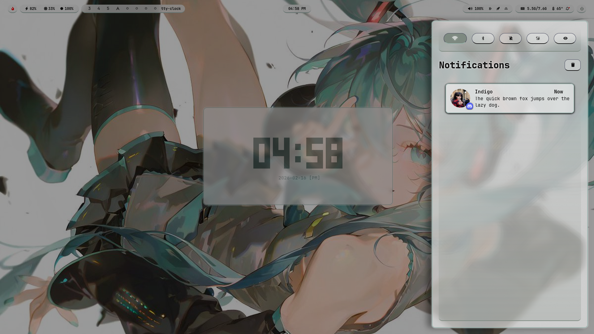
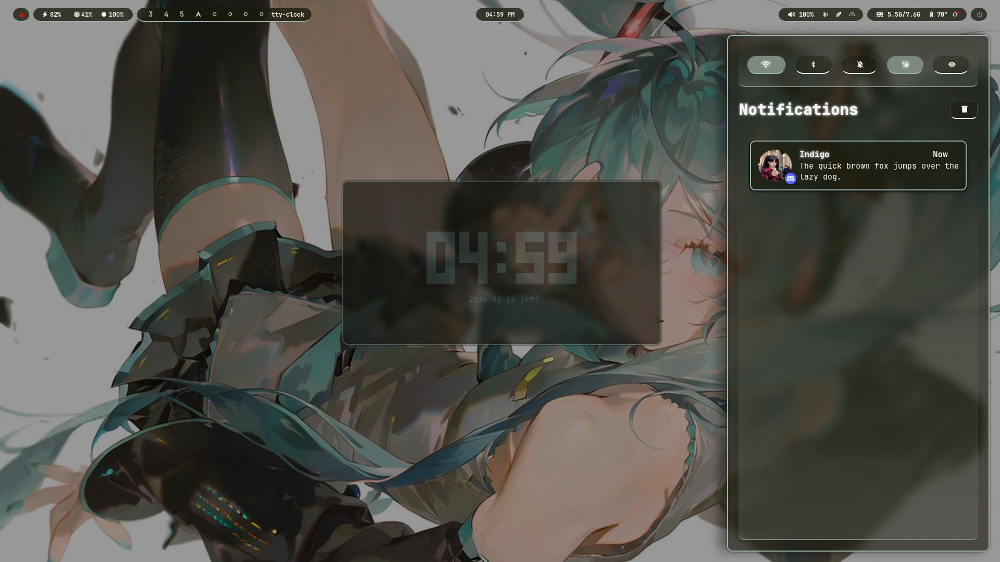
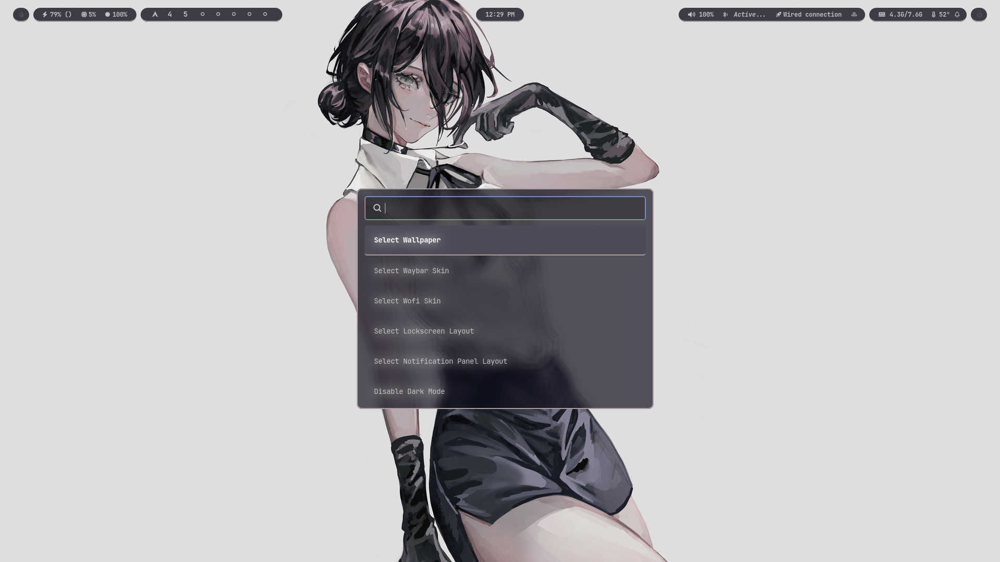

## Theming

bash scripts that are relevant to theming are:
- `bin/nekoroshell/customize` which handles modifying the config files to import from the selected active skin.
- `bin/nekoroshell/quick-theme` which wraps `customize` as a quick way to apply skins for every supported package; and
- the scripts at `.config/hypr/scripts/wallpapers` and `.config/themes/THEME/theme.sh`
<br>

### Wallpapers

Wallpapers are found in `.config/wallpapers`.
- File detection is recursive which means you can put them in folders and it should be fine.

Wallpapers are cached in `.cache/wallpaper-thumbs/`
- This is an optimization method to make sure the launcher (rofi) loads the images in a list faster. It also helps with decreasing the processing time of the `apply-colors.sh` bash script.

Image wallpapers are managed by awww, while animated wallpapers are managed by mpvpaper.

<br>

### Making a Skin

The directory structure of Skins are always `.config/PACKAGE/skins/SKIN/CONTENT`.

Depending on the package, the relevant files that make the Skins system work may vary. Make sure to analyze the directory structure of the following `.config` folders:
- `.config/waybar/` (Navbar)
  - The root `config.jsonc` and `style.css` imports from the active skin.
- `.config/rofi` (Launcher)
  - `config.rasi` imports from the active skin.
- `.config/hypr/hyprlock/` (Lockscreen)
  - `hyprlock.conf` in `hypr` imports from the active hyprlock skin.
- `.config/hypr/swaync/` (Panel/Control Centre)
  - `json`(s) can't import, so `bin/nekoroshell/customize` copies the contents of the active skin's `config.json` file over to the root `config.json` file.
  - `style.css` imports from the active skin.
<br>

You usually have two options when making a Skin:
- Install someone else's packge design/setup and then manually adjust its files to follow the directory and file organization schematics; or
- Make your own. This page won't teach you how to actually make and modify files, please read the documentation for the packages you want to make a skin for. ¯\_(ツ)_/¯
  - You don't have to, but you can make sure it supports the Dark and Light contrast modes by importing from wallust: `.cache/wallust/your-wallust-colors.extension`
<br>

waybar, rofi, and SwayNC Skins lets you dynamically configure hyprland `layerrule`(s).
  - Each of them has a `layerrule.conf` file.
  - These `layerrule.conf` files are then imported to `.config/hypr/configs/windowrules.conf` (usually found at the bottom).
<br>

Navbar Skins can utilize the Hover visibility mode via the `navbar-hover.conf` file.
  - This gets copied over to `/home/USERNAME/.cache/navbar-hover.conf` where `bin/nekoroshell/navbar-hover` reads it.
  - Options include `top`, `bottom`, `left`, and `right`.
  - Activation trigger value should always be lower than the Deactivation trigger value to prevent the accidental toggling of the navbar when reaching for a tool bar on top of the window.
<br>

### Making a Theme

Themes are found in `.config/themes`

To make a theme:
1. Make a folder and name it as you please.
2. Inside the folder, create a bash script.
3. In the bash script, type the following:
   ```bash
   quick-theme WALLPAPER_SKIN NAVBAR_SKIN LAUNCHER_SKIN LOCKSCREEN_SKIN PANEL_SKIN POWER_SKIN
   ```
   - `*_SKIN` are placeholders and should be replaced by actual names (case-sensitive).
   - You can even add extra logic or even triggers since it's a bash script.
<br>
<br>

 
<br>
<br>
<br>
 
<br>
<br>
<br>
 
<br>
<br>
